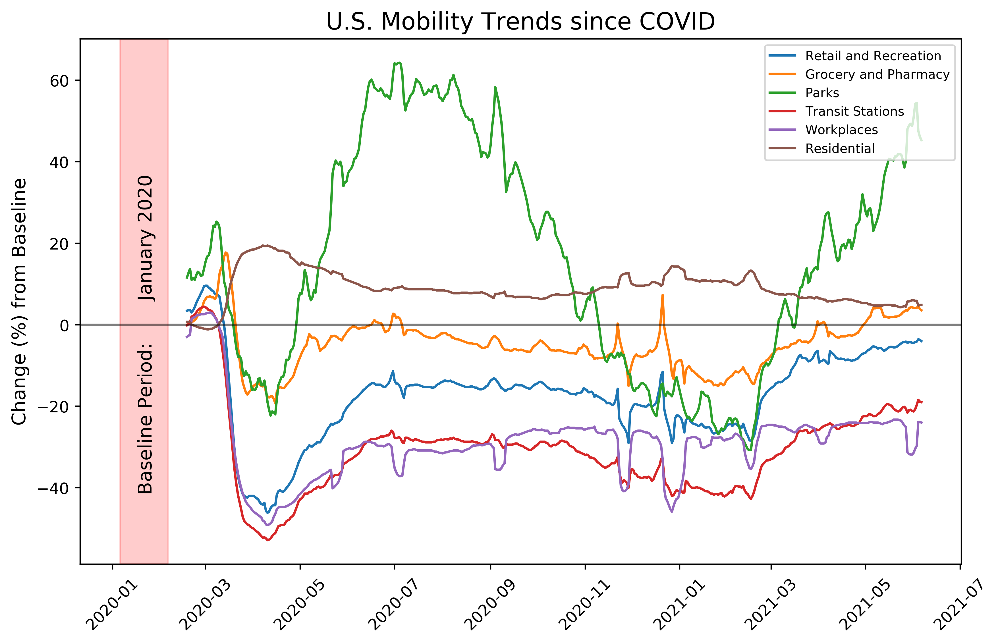
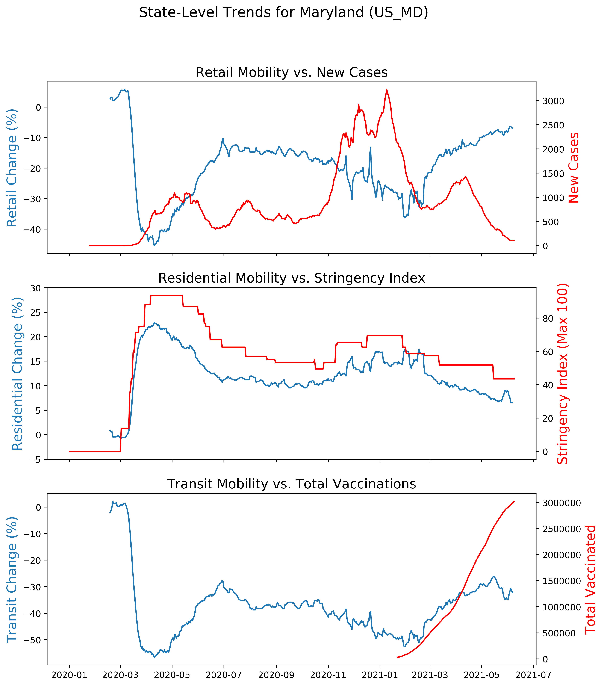
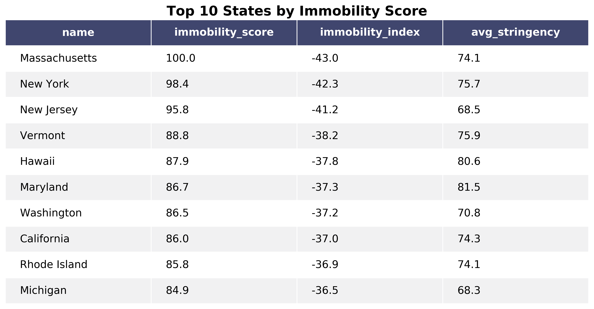
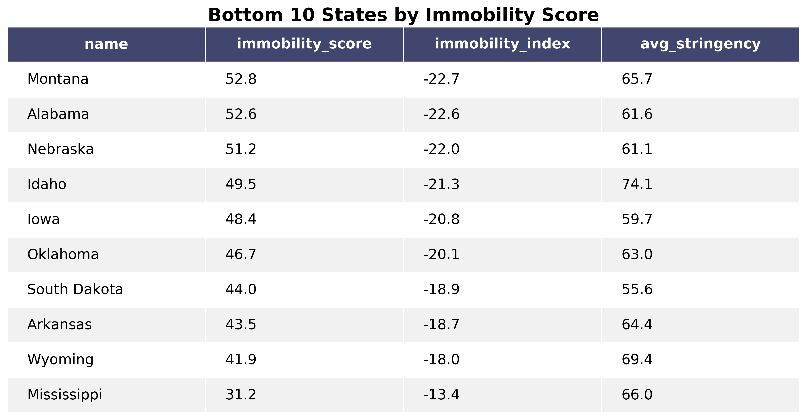

# COVID Mobility Trends

## Table of Contents

1. [Overview](#overview)
2. [Description of Data](#description)
3. [Data Processing](#processing)
4. [Overall Mobility Trends (US)](#overall)
5. [State-Level Example (MD)](#state)
7. [Comparison of Immobility Across States](#comparison)
8. [Hypothesis Testing for "Granger Causality"](#testing)
9. [Conclusions and Future Work](#future)

## Overview 
The COVID-19 outbreak disrupted almost every aspect of people's lives, and nowhere could this be seen more clearly than in our movement patterns. As lockdowns, shutdowns, quarantines, restrictions, and social distancing became the norm--and the law--people found themselves spending much more time in places like parks and their own residences, and much less time at work, transit stations, or retail locations. As part of their [COVID-19 Open Data Set](https://github.com/GoogleCloudPlatform/covid-19-open-data), Google released anonymized, aggregated mobility data across different regions obtained from users' cell phones. Within this data, we can see the sheer magnitude of movement changes that have been brought about by COVID, and begin to identify some key trends and patterns.

## Description of Data 

The COVID-19 Open Data Set contains daily time series data of over 500 variables for over 20,000 locations. We focused on the overall US and states and features related to mobility trends. We additionally looked at variables such as `stringency_index`, which summarizes the degree of enforced distancing imposed by a region's government. The entire dataset is stored on the Google Cloud Platform and can be freely queried [there](https://console.cloud.google.com/bigquery?p=bigquery-public-data&d=covid19_open_data) using SQL. Location-specific subsets be downloaded by using a specific location key, such as `US` for the entire United States, and `US_MD` for the state of Maryland.

 Descriptions of the mobility data can be found [here](https://github.com/GoogleCloudPlatform/covid-19-open-data/blob/main/docs/table-mobility.md) and [here](https://www.google.com/covid19/mobility/).  Descriptions of the stringency index and its associated governmental measures can be found [here](https://github.com/GoogleCloudPlatform/covid-19-open-data/blob/main/docs/table-government-response.md).

| Variable | Description | What it measures |
| --- | --- | --- | 
| mobility_retail_and_recreation | Places like restaurants, cafes, shopping centers, theme parks, museums, libraries, and movie theaters  | Percent (%) change in number of visits |
| mobility_grocery_and_pharmacy | Places like grocery markets, food warehouses, farmers markets, specialty food shops, drug stores, and pharmacies | Percent (%) change in number of visits |
| mobility_parks | Places like local parks, national parks, public beaches, marinas, dog parks, plazas, and public gardens | Percent (%) change in number of visits |
| mobility_transit_stations | Places like public transport hubs such as subway, bus, and train stations | Percent (%) change in number of visits |
| mobility_workplaces | Places of work | Percent (%) change in number of visits | 
| mobility_residential | Places of residence | Percent (%) change in  time spent |
| stringency_index | Overall severity of government controls, such as school/work closings, transport shutdowns, public event cancellations, restrictions on gatherings, etc. | An index from 0 (least severe) to 100 (most severe) |

### Limitations of the Data

1. These are cell phone data gathered from smart phone users who have Google Location Tracking enabled. This may not be representative of those who do not own smart phones, those who have not enabled Google Location Tracking, those who do not use Google services, and those who go to places where cell phones are not needed or not allowed.

2. We do not have access to absolute values, but rather only percentage change compared to a fixed baseline. This baseline was in the month of January 2020, immediately preceding the pandemic. Since this baseline was in the middle of winter, mobility changes thereafter would likely be influenced by the weather as well as by the impacts of the pandemic. For example, it is hard to tell how much the increase in Park visits during June 2020 was due to the lockdowns, versus the warmer weather. So one should be careful about comparing across different times of the year (in addition to other factors like holidays, region-specific events, etc.)

3. Location categorizations and accuracy are somewhat region-specific. One should be careful about directly comparing regions which are far apart and/or very different in culture.

## Data Processing 
We processed the data as follows:

1. **Time series smoothing** - We noticed the data exhibited a large amount of choppiness by day of the week, particularly between weekdays and weekends. This makes sense beacuse the mobility data were calculated with reference to a specific day of the week. So we took a 7-day moving average to smooth out the bumpiness.
2. **Interpolate/forward-fill missing values** - There were a lot of single missing values in the mobility variables, which we interpolated from surrounding values. There were also slightly longer chunks of missing values in stringency index, which we we forward-filled from preceding values.
3. **Remove extreme outliers (reporting errors)** - We forward-filled occasional extreme outliers (95%+ drops) in variables like cumulative vaccinated and confirmed cases. These were likely reporting errors, which got corrected by the next reporting day, but which were causing large irregularities when graphed.

## Overall Mobility Trends (US) 

To illustrate general trends, we plotted US mobility variables over the entire duration of the outbreak. Note the baseline period shaded in red. 

Some observations:

* **Retail/grocery/transit/workplace** mobility are highly correlated, dipping sharply at the outset of the pandemic, recovering somewhat and remaining significantly below baseline into the present day. It appears grocery mobility (labeled in orange) spiked for a few days as people went out to stock up on supplies in the very early days. Grocery mobility seems to be least affected by the pandemic, since people still need to buy food and essentials. Retail and recreation seems to have made a decent recovery. Workplaces and transit stations were the hardest hit and remain flat into the present day.
* **Residential**: This was the only variable that measured change in total time spent, rather than number of visits. As one would expect, reduced mobility in the other categories correponds with increase in residential mobility. Since it's a percentage change in total time spent, this variable is inherently capped. There's only 24 hours in a day and people already spent a considerable amount of their time at home before the pandemic.
* **Parks**: This was an idiosyncratic category. Since parks do not contribute as much to virus spread, it's likely that park mobility would increase as a substite for other activities. At the same time, parks are the most influenced by seasonality of weather. Since the baseline was in January, we would naturally expect park attendance to increase dramatically moving into summer. What we see is a slight dip in the beginning along with everything else, and then a sustained rise throughout the warmer months. Park attendance was noticeably down in January 2021, without the effects of seasonality, so perhaps the effect of the pandemic on park attendance is in fact negative.

## State-Level Example (MD) 

We explored state-level data for Maryland and plot some mobility trends against variables associated with lockdowns and the virus spread.

**Retail Mobility vs. New Cases** - Retail mobility seems loosely related to the number of new cases (note this is not cumulative). Retail mobility 

**Residential Mobility vs. Stringency Index** - There's a remarkablly strong correspondence between residential mobility and stringency index. As stringency rose and then gradually declined into the pandemic, the amount of time spent at home rose sharply and then gradually declined in unison. The amount of time people spend at home seems an excellent reflection of an area's stringency index.

**Transit Mobility vs. Total Vaccinations** - While the number of vaccinations rose into the millions, transit mobility is still 30% below baseline. We can see a slight reecovery, but this could also just be due to seasonality. It appears that people getting vaccinated is not leading them to return to transit stations, at least anytime soon.

## Comparison of Immobility Across States 
We wanted to compare how different states' movement patterns were affected by the pandemic. More specifically, which states had the most reduced mobility? To this effect, we introduced an immobility index which took the average of retail/grocery/workplace/transit variables across the following 4 weeks:

> 1. The 2 weeks following the date of max stringency index. This reflects the immediate and most acute response to the pandemic.
> 2. The 2 weeks in the middle of January 2021. This serves as a direct comparison with the baseline, removing effects of seasonality.

Then we normalized to get an immobility score, where the most immobile state gets a maximum score of 100.

We see that the most immobile states were largely

The l

See the full table [here](img/state_comparison.png).

## Hypothesis Testing for Granger causuality 
In general it's difficult to conduct hypothesis tests on time series because the data points are not independent of each other. However, there is a testable notion called "Granger causality" which was developed specifically for time series. 

> Definition: Time series A is said to Granger-cause timee series B if A contains predictive information about B beyond what is contained in the previous values of B.

Note that, despite the name, Granger causality is far from implying true causality.

We hypothesized that, across the United States, the stringency index (how it changes over time) would Granger-cause the mobility trends to retail locations we observe. In other words, changes in public policy (either tightening or loosening of restrictions) would contain predictive information about people's movement patterns, particularly to discretionary locations like retail.

To conduct the test, we used the `grangercausalitytests` function from the `statsmodels.tsa.stattools` module. We ran the tests on stringency index and retail mobility for the United States over the period from February 25, 2020 to June 1, 2021. This contains a large selection of time points over different stages of the pandemic. For the testing, we chose a max lag value of 7 corresponding to the number of days in the week, although there are more rigorous ways of doing this. We conducted the tests both for the raw series and for versions of the series which were differenced to partially remove non-stationarity. The p=values corresponding to the ssr-based F test for Granger causality are reported below, for each lag value.

> Null hypothesis: `stringency_index` does **not** Granger-cause `mobility_retail_and_recreation`. 

> We select our alpha level to be 0.05, so we reject the null hypothesis if the p-value is below 0.05.

| Lag value | p-value (raw series)| p-value (differenced series) |
| --- | --- | ---|
| 1 | 0.0310| 0.0000 |
| 2 | 0.0003| 0.0000 |
| 3 | 0.0000| 0.0000 |
| 4 | 0.0001| 0.0000 |
| 5 | 0.0002| 0.0001|
| 6 | 0.0008| 0.0002|
| 7 | 0.0010| 0.0000|

We see that all the p-values are low enough to reject the null hypothesis individually. However, for the raw series with a time lag of 1, the p-value is 0.03, which although less than 0.05, would not allow us to reject after performing a Boneferroni correction for conducting multiplie comparisons. Therefore, we cannot reject the null hypothesis; however tempting, we cannot claim that stringency index Granger-causes retail mobility.

## Conclusions and Future Work 

WEwe

1. 
2.  

## References

1. https://console.cloud.google.com/marketplace/product/bigquery-public-datasets/covid19-open-data
2. https://github.com/GoogleCloudPlatform/covid-19-open-data
3. https://www.google.com/covid19/mobility/
4. https://en.wikipedia.org/wiki/Granger_causality
5. https://stackoverflow.com/questions/19726663/how-to-save-the-pandas-dataframe-series-data-as-a-figure